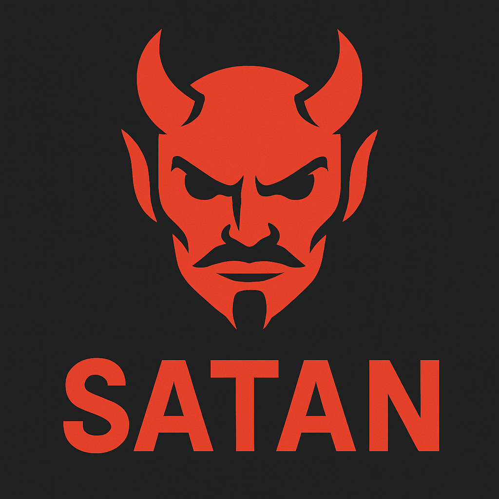
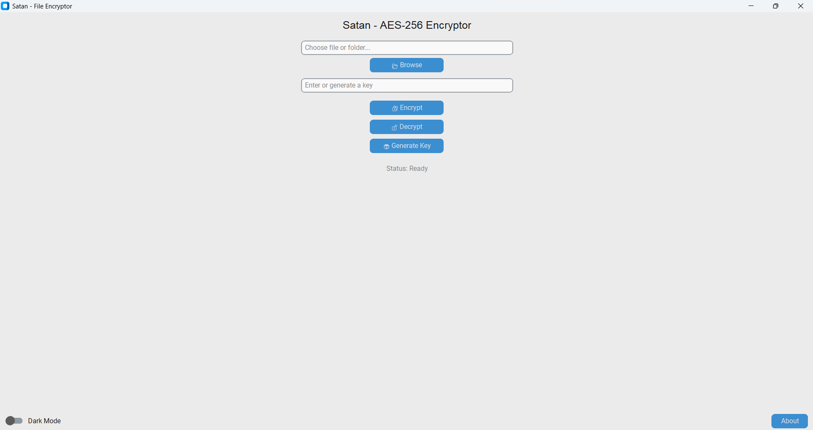
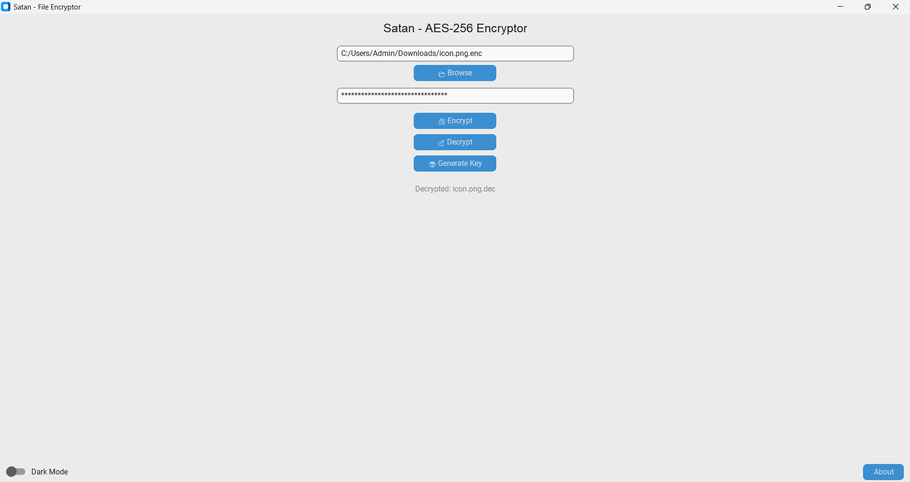

<p align="center">
  
  <h1 align="center">Satan 🔐</h1>
  <p align="center"><strong>AES-256 File & Folder Encryptor</strong></p>
  <p align="center">Secure any file or folder with a modern Python GUI powered by AES encryption.</p>
</p>

---

## 🌟 Features

- 🔐 AES-256 encryption (CBC mode)
- 📂 Encrypt/decrypt any file or folder
- 🧬 Generate secure encryption keys
- 🌓 Toggle dark/light theme
- 💾 Save settings automatically
- 📜 MIT licensed and open-source
- 🧊 Packaged as `.exe` with icon (for Windows)
- 🧱 Modular and maintainable architecture

---

## 📸 Screenshots

| Main Interface | Encrypt/Decrypt |
|----------------|-----------------|
|  |  

---

## 🚀 Getting Started

### 🖥️ Run from Source

```bash
# Clone the repo
git clone https://github.com/Suryabx/Satan-AES-256-File-Folder-Encryptor.git
cd Satan-AES-256-File-Folder-Encryptor

# Create virtual environment
python -m venv .venv
.venv\Scripts\activate  # Windows

# Install dependencies
pip install -r requirements.txt

# Launch the app
python main.py
